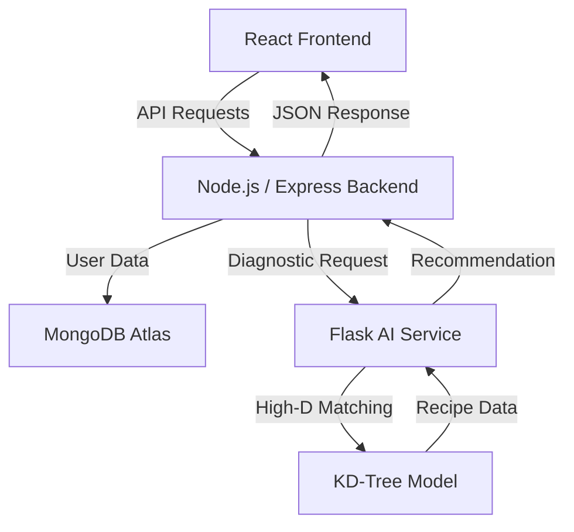

# NutriPlan Pro: Advanced AI-Driven Metabolic Modeling & Dietary Intelligence

NutriPlan Pro is a sophisticated health-tech ecosystem designed to provide high-precision dietary intelligence. By leveraging advanced metabolic diagnostics and high-dimensional spatial algorithms, it delivers personalized nutrition plans tailored to your unique physiological profile and performance goals.

---

## 🚀 Key Features

### 🧠 AI-Powered Metabolic Diagnostics
Deep analysis of biological markers including **BMI**, **BMR**, and **TDEE**. Our engine processes your age, morphology, and activity levels to calculate precise daily caloric and macronutrient requirements.

### ⚡ KD-Tree Recommendation Engine
Powered by a Python-Flask microservice, NutriPlan Pro utilizes the **KD-Tree (K-Dimensional Tree)** algorithm to partition large-scale nutritional datasets. This ensures sub-second latency in matching you with the optimal dietary combinations from thousands of data points.

### 📊 Performance Visualization
Interactive **ApexCharts** dashboard providing real-time insights into:
- **Macro Profiling**: Detailed breakdowns of Protein, Carbohydrates, and Fats.
- **Energy Variance**: Tracking caloric density across multi-meal frequencies.
- **Progressive History**: Visual snapshots of your dietary evolution.

### 🛡️ Secure History Vault
An encrypted archive of your previous diet plans. Revisit successful cycles, track long-term adaptation, and maintain a persistent record of your health optimization journey.

### 🌍 Community Core
A collaborative discussion forum where users engage in nutritional discourse, share success stories, and crowdsource health insights.

### 💎 Premium Membership Dashboard
Tiered access designed for different levels of commitment:
- **Basic**: Core diagnostics and standard tracking.
- **Pro**: Unlimited generations, advanced frequency selection, and full history vault.
- **Elite**: Priority AI processing and weekly metabolic intelligence reports.

---

## 🛠️ Technology Stack

### Ecosystem Architecture


| Layer | Technologies |
| :--- | :--- |
| **Frontend** | React 18, Tailwind CSS, ApexCharts, Framer Motion |
| **Backend** | Node.js, Express.js |
| **Database** | MongoDB (Mongoose ODM) |
| **Intelligence** | Python, Flask, Scikit-learn (KD-Tree) |
| **Authentication** | JSON Web Tokens (JWT), Bcrypt |

---

## ⚙️ Configuration & Setup

### Environment Variables
Configure your environment in both the `/backend` and `/frontend` directories.

#### Backend (`/backend/.env`)
```env
PORT=8000
SECRET_KEY=your_secure_jwt_secret
MONGO_URI=your_mongodb_connection_string
MAIL_USER=your_smtp_email
PASS_KEY=your_app_password
FRONTEND_URL=http://localhost:5173
```

#### Frontend (`/frontend/.env`)
```env
VITE_ConnString=http://localhost:8000
```

### Installation

1. **Clone the Repository**
   ```bash
   git clone https://github.com/DhruvItaliya/NutriPlanPro
   cd NutriPlanPro
   ```

2. **Backend Services**
   ```bash
   cd backend
   npm install
   npm run dev
   ```

3. **Client Interface**
   ```bash
   cd frontend
   npm install
   npm run dev
   ```

4. **Intelligence Service (Flask)**
   ```bash
   cd flask_server
   pip install -r requirements.txt # Or install Flask, Flask-Cors
   python app.py
   ```

---

## 📖 Glossary
- **BMR (Basal Metabolic Rate)**: The energy expended at rest.
- **BMI (Body Mass Index)**: A ratio of height to weight for health classification.
- **TDEE (Total Daily Energy Expenditure)**: Total calories burned including physical activity.
- **KD-Tree**: A space-partitioning data structure for organizing points in a k-dimensional space.

---

Built with ❤️ for a healthier world.
